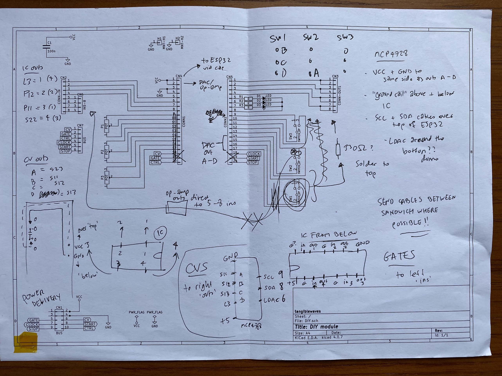

# BTLE-MIDI-2-CV
DIY AE module for receiving MIDI signals via bluetooth and converting to CV and gates
---

4-channel bluetooth MIDI receiver, intended specifically for using with software such as [Orca](https://git.sr.ht/~rabbits/orca) and iOS apps like [Xynthesizr](https://apps.apple.com/us/app/xynthesizr/id720810459) and [Fugue Machine](https://apps.apple.com/us/app/fugue-machine-midi-sequencer/id1014191410)

Idea prompted by duddex on the TW forum who worked on a similar project: https://forum.aemodular.com/thread/2287/bluetooth-midi-cv-esp32

Built for the Tangible Waves AE format using the DIY module kit: https://wiki.aemodular.com/pmwiki.php/AeManual/DIY

Other required bits in addition to wires, resistors, caps:
- [Unexpected Maker TinyS3 ESP32 board](https://esp32s3.com/)
- [Adafruit MCP4728 quad DAC](https://learn.adafruit.com/adafruit-mcp4728-i2c-quad-dac)
- [74AHCT125 quad level shifter](https://www.adafruit.com/product/1787)

I did this somewhat 'on the fly' and my notes are chaotic so no schematic, sorry!
But essentially the TinyS3 sends CV values to the DAC over I2C,
and gate triggers go out to the level shifter to boost them from 3.3v to 5v.

This module has no physical input connections.
The DIY module only provides 4 discrete outputs (in pairs). I wanted to output four complete channels of CV *and* gates, so I made use of the unused input connectors.

**On the left of the module** (which would normally be inputs, the top 4 connections provide gate outs.

**On the right hand side,** there are 4 channels of CV out, in pairs. (See diagram in Images folder)

It's unlikely that this image of my working out will help, but just in case...

